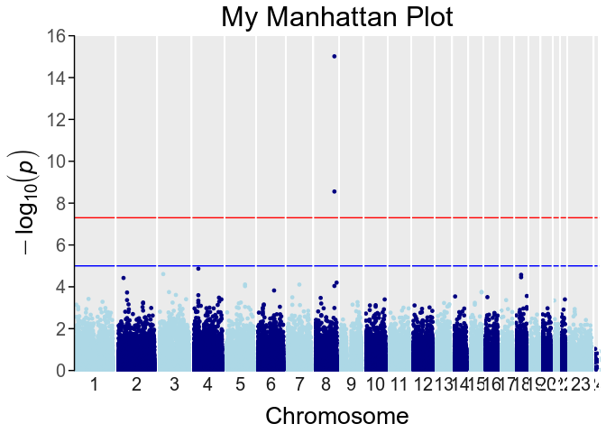
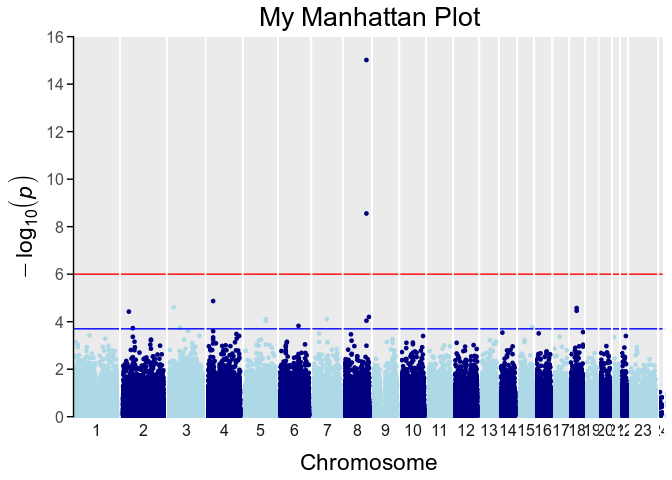
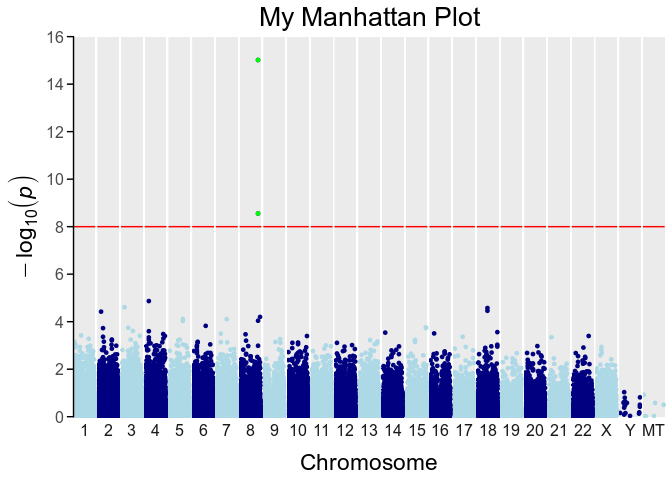

# myManhattan
I present here an R function to generate Manhattan plots using `ggplot`. It also returns a list of significant SNPs, according to different thresholds, if desired.


From [Wikipedia](https://en.wikipedia.org/wiki/Manhattan_plot), the free encyclopedia

A Manhattan plot is a type of scatter plot, usually used to display data with a large number of data-points - many of non-zero amplitude, and with a distribution of higher-magnitude values, for instance in genome-wide association studies (GWAS). In GWAS Manhattan plots, genomic coordinates are displayed along the X-axis, with the negative logarithm of the association P-value for each single nucleotide polymorphism (SNP) displayed on the Y-axis, meaning that each dot on the Manhattan plot signifies a SNP. Because the strongest associations have the smallest P-values (e.g., 10−15), their negative logarithms will be the greatest (e.g., 15).

Installation
============

Download the repository from [github](https://github.com/alfonsosaera/myManhattan.git) or clone it by typing in the terminal

    git clone https://github.com/alfonsosaera/myManhattan.git

Usage
=====

You can copy the function from the `myManhattanFunction.R` file or load it using `source`

``` r
source("myManhattanFunction.R")
```

Input data
----------

Load data and take a look to the file to show the required structure

``` r
ex <- read.table("example.txt")
head(ex)
```

    ##                   SNP CHR      BP         P
    ## rs12124819 rs12124819   1  766409 0.7668670
    ## rs28705211 rs28705211   1  890368 0.8026096
    ## rs9777703   rs9777703   1  918699 0.3812962
    ## rs3121567   rs3121567   1  933331 0.6391422
    ## rs9442372   rs9442372   1 1008567 0.6082297
    ## rs3737728   rs3737728   1 1011278 0.9558932

Using function with defaults settings

``` r
myManhattan(ex)
```


Add title
---------

The `graph.title` argument is used to specify a title:

``` r
myManhattan(ex, graph.title = "My Manhattan Plot")
```


Use the `font.size` argument (default is 12) to modify the size of all text elements in the graph.

``` r
myManhattan(ex, graph.title = "My Manhattan Plot", font.size = 15)
```



Indicative lines
----------------

Where to draw a "genome-wide sigificant" (red) or "suggestive" (blue) line.<br />
`genomewideline` default is 5e-08.<br />
`suggestiveline` default is 1e-5.

Set to FALSE to disable.

``` r
myManhattan(ex, graph.title = "My Manhattan Plot",
            suggestiveline = FALSE, genomewideline = 1e-8)
```


Both can be specified.

``` r
myManhattan(ex, graph.title = "My Manhattan Plot",
            suggestiveline = 2e-4, genomewideline = 1e-6)
```



Mark specific points
--------------------

Use the `highlight` argument (default is `NULL`). The `highlight.col` argument sets the color (Default is "green").

If set to a numeric value, all SNPs with a p-value lower than the specified value are marked.

``` r
myManhattan(ex, graph.title = "My Manhattan Plot", suggestiveline = FALSE,
            genomewideline = 1e-8, highlight = 1e-8)
```


You can also mark specific SNP providing the names

``` r
my.SNPs <- as.character(ex$SNP[ex$P < 1e-8])

myManhattan(ex, graph.title = "My Manhattan Plot", suggestiveline = 1e-6,
            genomewideline = 1e-8, highlight = my.SNPs)
```


Graph appearance
----------------

Proportion of each chromosome is modified with `even.facet` argument.

``` r
myManhattan(ex, graph.title = "My Manhattan Plot", suggestiveline = FALSE,
            genomewideline = 1e-8, highlight = 1e-8, even.facet = T)
```


Specify chromosome names with `crhom.lab` argument

``` r
myManhattan(ex, graph.title = "My Manhattan Plot", suggestiveline = FALSE,
            genomewideline = 1e-8, highlight = 1e-8, even.facet = T,
            chrom.lab = c(as.character(1:22),"X","Y","MT"))
```


Specify chromosome colors with `col` argument, default is `c("lightblue", "blue")`. See <http://www.stat.columbia.edu/~tzheng/files/Rcolor.pdf> for a list of colors. See <https://www.r-bloggers.com/palettes-in-r/> for pallete use in R.

``` r
myManhattan(ex, graph.title = "My Manhattan Plot", suggestiveline = FALSE, genomewideline = 1e-8,
            col = rainbow(25), even.facet = T, chrom.lab = c(as.character(1:22),"X","Y","MT"))
```



Significance level
------------------

Specify significance levels with `significance` argument. This argument overrides `genomewideline` and `suggestiveline`. When argument `report` is set to `TRUE` the info of the significant SNPs is printed.

`significance` argument can set to a specific number

``` r
myManhattan(ex, graph.title = "My Manhattan Plot", suggestiveline = 2e-4,
            genomewideline = 1e-6, even.facet = T,
            chrom.lab = c(as.character(1:22),"X","Y","MT"), significance = 3e-5,
            report = TRUE)
```

    ##                   SNP CHR        BP            P
    ## rs6550962   rs6550962   3  25356968 2.462824e-05
    ## rs10027212 rs10027212   4  30585306 1.357062e-05
    ## rs4733560   rs4733560   8 128848183 2.789866e-09
    ## rs10112382 rs10112382   8 128853579 9.641204e-16
    ## rs17769347 rs17769347  18  36989057 2.663669e-05


If `significance` is set to "Bonferroni", `genomewideline` is set to the corrected significance level and `suggestiveline` is modified accordingly.

``` r
myManhattan(ex, graph.title = "My Manhattan Plot", suggestiveline = 2e-4,
            genomewideline = 1e-6, even.facet = T,
            chrom.lab = c(as.character(1:22),"X","Y","MT"), significance = "Bonferroni",
            report = TRUE)
```

    ## Bonferroni correction significance level: 5.039103e-07
    ##                   SNP CHR        BP            P
    ## rs4733560   rs4733560   8 128848183 2.789866e-09
    ## rs10112382 rs10112382   8 128853579 9.641204e-16


If `significance` is set to "FDR", `genomewideline` is set to `0.05` and `suggestiveline` to `FALSE`.

``` r
myManhattan(ex, graph.title = "My Manhattan Plot", suggestiveline = 2e-4,
            genomewideline = 1e-6, even.facet = T,
            chrom.lab = c(as.character(1:22),"X","Y","MT"), significance = "FDR",
            report = TRUE)
```

    ##                   SNP CHR        BP            P          fdr
    ## rs4733560   rs4733560   8 128848183 2.789866e-09 1.384108e-04
    ## rs10112382 rs10112382   8 128853579 9.641204e-16 9.566388e-11


Further customization
---------------------

Since the function returns a `ggplot` object you can add your own modifications.

First, store the function output in an object

``` r
mM <- myManhattan(ex, graph.title = "My Manhattan Plot", even.facet = T,
             chrom.lab = c(as.character(1:22),"X","Y","MT"))

mM # check the plot
```


Then, add your modifications. In this case, changing the title of Y axis

``` r
mM + ylab(expression("Association to Phenotype (" * -log[10](italic(p)) *")"))
```


